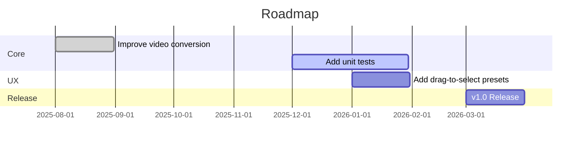

<div align="center">


# FileForge

**Universal File Converter — Fast, private, and in-browser**

---

<!-- Badge rows -->
<div align="center">

<!-- Row 1: repo badges -->
[](https://github.com/primexalbin/fileforge/stargazers)
[](https://github.com/primexalbin/fileforge/network/members)
[](https://github.com/primexalbin/fileforge/issues)
[](LICENSE)
[](https://github.com/primexalbin/fileforge/graphs/contributors)

<!-- Row 2: CI / Versions (placeholders) -->
[](https://github.com/primexalbin/fileforge/actions/workflows/ci.yml)
[](https://codecov.io/gh/primexalbin/fileforge)
[](https://github.com/primexalbin/fileforge/pkgs/container/fileforge)
[](#)
[](#)

<!-- Row 3: Tech stack badges (detected) -->
[](https://reactjs.org/)
[](https://www.typescriptlang.org)
[](https://vitejs.dev/)
[](https://tailwindcss.com/)
[](https://ffmpeg.org/)
[](https://github.com/pmndrs/zustand)

---

🔗 Quick links: [Documentation](#architecture) • [Report Bug](https://github.com/primexalbin/fileforge/issues/new?template=bug.md) • [Request Feature](https://github.com/primexalbin/fileforge/issues/new?template=feature.md)

</div>

<br />

<div align="center">
  

  <p class="caption">[PLACEHOLDER] Demo: drag & drop files, select output format, and convert instantly — all in the browser.</p>

  <details>
    <summary>More Screenshots</summary>

| Upload / Dropzone | Conversion Queue | Settings |
| --- | --- | --- |
|  |  |  |

  </details>
</div>

---

<details>
<summary><strong>Table of Contents</strong></summary>

1. [Features](#features)
2. [Why FileForge?](#why-this-project)
3. [Quick Start](#quick-start)
4. [Installation](#installation)
5. [Usage](#usage)
6. [Architecture](#architecture)
7. [API Reference](#api-reference)
8. [Configuration](#configuration)
9. [Testing](#testing)
10. [Roadmap](#roadmap)
11. [Contributing](#contributing)
12. [Security](#security)
13. [Sponsors](#sponsors)
14. [Support](#support)
15. [License](#license)
16. [Acknowledgments](#acknowledgments)

</details>

---

## Features ✅

<div align="center">

| Core Features | Developer Experience |
| --- | --- |
| ✅ Convert images, documents, audio, video, spreadsheets & archives (200+ formats) | ✅ TypeScript-first, small, modular converters |
| ✅ In-browser conversions (no uploads) 🔒 | ✅ Vite + Hot Module Replacement |
| ✅ FFmpeg (browser) for audio/video conversions 🎛️ | ✅ Friendly hooks: `useConversion`, `useTheme` |
| ✅ Batch conversions & queue management ⚡ | ✅ Clean stores with Zustand |
| ✅ Format detection via magic bytes & MIME types 🔍 | ✅ Small, well-typed utilities & helpers |

</div>

> ASCII Highlight

```
┌─────────────────────────┐
│  FileForge - Key Value  │
│  • Private in-browser   │
│  • 200+ formats         │
│  • Fast, zero-uploads   │
└─────────────────────────┘
```

---

## Why this project ✨

| Before | After |
| --- | --- |
| Upload large files to server (slow, private) | Convert locally in browser (fast & private) |
| Complex multi-service pipelines | Single, modular web app with pluggable converters |

---

## Quick Start ⚡

Fastest way to get running (npm is detected via package-lock.json):

```bash
# Install deps and start dev server
npm install && npm run dev
```

Or open with Visual Studio Code and press F5 (Vite + React plugin). The app name shown in UI: **FileForge**.

---

## Installation 🔧

### Prerequisites

| Tool | Minimum Version | Notes |
| --- | ---: | --- |
| Node.js | 18+ | Recommended LTS |
| npm | 9+ | package-lock.json detected |
| Browser | Latest Chrome/Firefox/Safari | Required for modern browser features |

<details>
<summary>npm (recommended)</summary>

```bash
npm install
npm run dev      # start development server
npm run build    # production build
npm run preview  # preview build
```

</details>

<details>
<summary>yarn / pnpm (alternatives)</summary>

```bash
# yarn
yarn
yarn dev

# pnpm
pnpm install
pnpm dev
```

</details>

<details>
<summary>Docker (build & serve)</summary>

```bash
# Build and run with Docker (production image)
docker build -t ghcr.io/primexalbin/fileforge:latest .
docker run -p 8080:80 ghcr.io/primexalbin/fileforge:latest

# Pull from GitHub Container Registry
# docker pull ghcr.io/primexalbin/fileforge:latest
```

This repository also includes a GitHub Actions workflow to publish images to GitHub Container Registry (GHCR) on pushes to `main`.

</details>

---

## Usage 📦

### Web App

- Open http://localhost:5173 after running `npm run dev`.
- Drag & drop files, choose output format, hit **Convert All**.
- Results are available in the Conversion Queue; download individual files or a ZIP of completed items.

### Programmatic API (internal/library usage)

You can use the converters programmatically (useful for embedding in other apps):

```ts
import { convertFile, isConversionSupported } from '@/converters';

const blob = await convertFile(file, 'png', 'jpg', { quality: 85 }, (p) => console.log('progress', p));

console.log('Supported?', isConversionSupported('png', 'jpg'));
```

Notes:
- `convertFile` returns a `Blob` or `Blob[]` depending on output (e.g., PDF -> images returns multiple blobs).
- `onProgress` is optional and receives percentage [0-100].

<details>
<summary>Advanced Usage</summary>

#### FFmpeg (for video/audio)

FFmpeg is loaded in-browser on demand (first use downloads ~31MB). You can monitor FFmpeg loading via `getFFmpeg(onProgress)` exported from `src/lib/ffmpeg.ts`.

```ts
import { getFFmpeg } from '@/lib/ffmpeg';
const ff = await getFFmpeg((msg)=>console.log(msg));
```

</details>

---

## Architecture 🏗️

ASCII system architecture:

```
[Browser]
   |-- UI (React + Tailwind)
   |-- ConversionQueue (Zustand store)
   |-- FileDropzone -> detectFormat -> converters
   |-- FFmpeg (WebAssembly) for heavy-lifting
   +-- IndexedDB (history)
```

Project structure (partial):

```
src/
├─ components/      # React UI components (Dropzone, Queue, Previews)
├─ converters/      # Conversion logic per category (image, video, doc...)
│  ├─ image/
│  ├─ document/
│  └─ video/
├─ lib/             # low-level helpers (ffmpeg, historyDB)
├─ stores/          # Zustand stores
├─ utils/           # helpers (formatDetector, file utilities)
├─ hooks/           # custom hooks (useConversion, useTheme)
└─ types/           # TypeScript types
```

---

## API Reference 📚

### convertFile(file, inputFormat, outputFormat, options?, onProgress?)

| Parameter | Type | Required | Default | Description |
| --- | --- | :---: | --- | --- |
| file | File | ✓ | — | Input file to convert |
| inputFormat | string | ✓ | — | Input extension (e.g., "png") |
| outputFormat | string | ✓ | — | Desired output extension (e.g., "jpg") |
| options | ConversionOptions | ✗ | {} | Format-specific options (quality, bitrate, etc.) |
| onProgress | (p:number) => void | ✗ | — | Progress callback (percentage 0-100) |

Returns: Promise<Blob | Blob[]>

### isConversionSupported(inputFormat, outputFormat)

| Parameter | Type | Required | Description |
| --- | --- | :---: | --- |
| inputFormat | string | ✓ | Input extension |
| outputFormat | string | ✓ | Output extension |

Returns: boolean

### detectFormat(file)

Detects format using magic bytes, mime type, or extension. Returns object with extension, mimeType, category, confidence, detectedBy.

### getFFmpeg(onProgress?)

Loads the browser FFmpeg instance. Useful for direct control in advanced flows.

---

## Configuration ⚙️

There are no required environment variables by default.

.env.example (optional)

```
# VITE_FFMPEG_BASEURL=https://my-cdn.example.com/ffmpeg
# (Not currently read by default; advanced customization only)
```

---

## Testing 🧪

Vitest is configured for unit tests with a small, fast test runner (jsdom environment).

Available commands:

```bash
npm run lint          # run ESLint
npm run test          # run tests (Vitest)
npm run test:watch    # run tests in watch mode
npm run test:coverage # run tests and collect coverage
npm run build         # build production assets
npm run dev           # start development server
```

Consider adding Jest or Vitest for unit testing and Playwright / Cypress for E2E.

---

## Benchmarks (placeholder) 🧾

| Operation | Median Time | Notes |
| --- | ---: | --- |
| PNG → JPG (2MB image) | ~200ms | Browser-based conversion using pica |
| Video transcode (short clip) | ~5s | Uses FFmpeg WASM (first-load penalty applies) |

```
████████████▉  80%  PNG → JPG
████████▊      45%  Video transcode
```

---

## Roadmap 🛣️



- [ ] Add E2E tests
- [ ] Add plugin/extension system
- [ ] Add server-side batch processing option

---

## Contributing 🤝

We ❤️ contributions. Please open issues or PRs.

Commit conventions (recommendation):

| Type | Description |
| --- | --- |
| feat | A new feature |
| fix | A bug fix |
| docs | Documentation only changes |
| style | Formatting, missing semicolons, etc. |
| refactor | Code change that neither fixes a bug nor adds a feature |

Contributors image (primexalbin/fileforge):


---

## Security 🔐

If you discover a security vulnerability, please report it to the maintainers by opening an issue (mark as private) or emailing [PLACEHOLDER: security contact].

Security features:

- In-browser conversions (no server upload) — mitigates data leakage.
- Uses IndexedDB for local history (optional to clear).

---

## Sponsors 💖

Gold / Silver / Bronze sponsorship placeholders — to be filled.

---

## Support 📬

| Channel | Details |
| --- | --- |
| Issues | https://github.com/PRIMExALBIN/FileForge/issues |
| Discussions | https://github.com/PRIMExALBIN/FileForge/discussions |
| Email | [PLACEHOLDER: maintainer@example.com] |

---

## License 📜

This project is licensed under the MIT License — see the full license below and the `LICENSE` file in the repository.

<details>
  <summary>MIT License (click to expand)</summary>

  ```text
  MIT License

  Copyright (c) 2026 PRIMExALBIN

  Permission is hereby granted, free of charge, to any person obtaining a copy
  of this software and associated documentation files (the "Software"), to deal
  in the Software without restriction, including without limitation the rights
  to use, copy, modify, merge, publish, distribute, sublicense, and/or sell
  copies of the Software, and to permit persons to whom the Software is
  furnished to do so, subject to the following conditions:

  The above copyright notice and this permission notice shall be included in all
  copies or substantial portions of the Software.

  THE SOFTWARE IS PROVIDED "AS IS", WITHOUT WARRANTY OF ANY KIND, EXPRESS OR
  IMPLIED, INCLUDING BUT NOT LIMITED TO THE WARRANTIES OF MERCHANTABILITY,
  FITNESS FOR A PARTICULAR PURPOSE AND NONINFRINGEMENT. IN NO EVENT SHALL THE
  AUTHORS OR COPYRIGHT HOLDERS BE LIABLE FOR ANY CLAIM, DAMAGES OR OTHER
  LIABILITY, WHETHER IN AN ACTION OF CONTRACT, TORT OR OTHERWISE, ARISING FROM,
  OUT OF OR IN CONNECTION WITH THE SOFTWARE OR THE USE OR OTHER DEALINGS IN THE
  SOFTWARE.
  ```

</details>

<div align="center">
© 2026 PRIMExALBIN • Licensed under the MIT License
</div>

---

## Acknowledgments 🙏

- [@ffmpeg/ffmpeg] for in-browser FFmpeg
- [Zustand] for small, ergonomic stores
- Browser-image-compression, pdf-lib, mammoth, xlsx, and many more (see package.json for full list)

---

<div align="center">
⭐ If you find FileForge useful, please give it a star! ⭐

[](https://github.com/PRIMExALBIN/FileForge)


[BUY ME A COFFEE](https://www.buymeacoffee.com/[PLACEHOLDER]) • Built with ❤️ by the community
</div>

[screenshot-1]: ./public/screenshots/screenshot-1.png
[screenshot-2]: ./public/screenshots/screenshot-2.png
[screenshot-3]: ./public/screenshots/screenshot-3.png
[demo]: ./public/screenshots/demo.gif
# React + TypeScript + Vite

This template provides a minimal setup to get React working in Vite with HMR and some ESLint rules.

Currently, two official plugins are available:

- [@vitejs/plugin-react](https://github.com/vitejs/vite-plugin-react/blob/main/packages/plugin-react) uses [Babel](https://babeljs.io/) (or [oxc](https://oxc.rs) when used in [rolldown-vite](https://vite.dev/guide/rolldown)) for Fast Refresh
- [@vitejs/plugin-react-swc](https://github.com/vitejs/vite-plugin-react/blob/main/packages/plugin-react-swc) uses [SWC](https://swc.rs/) for Fast Refresh

## React Compiler

The React Compiler is not enabled on this template because of its impact on dev & build performances. To add it, see [this documentation](https://react.dev/learn/react-compiler/installation).

## Expanding the ESLint configuration

If you are developing a production application, we recommend updating the configuration to enable type-aware lint rules:

```js
export default defineConfig([
  globalIgnores(['dist']),
  {
    files: ['**/*.{ts,tsx}'],
    extends: [
      // Other configs...

      // Remove tseslint.configs.recommended and replace with this
      tseslint.configs.recommendedTypeChecked,
      // Alternatively, use this for stricter rules
      tseslint.configs.strictTypeChecked,
      // Optionally, add this for stylistic rules
      tseslint.configs.stylisticTypeChecked,

      // Other configs...
    ],
    languageOptions: {
      parserOptions: {
        project: ['./tsconfig.node.json', './tsconfig.app.json'],
        tsconfigRootDir: import.meta.dirname,
      },
      // other options...
    },
  },
])
```

You can also install [eslint-plugin-react-x](https://github.com/Rel1cx/eslint-react/tree/main/packages/plugins/eslint-plugin-react-x) and [eslint-plugin-react-dom](https://github.com/Rel1cx/eslint-react/tree/main/packages/plugins/eslint-plugin-react-dom) for React-specific lint rules:

```js
// eslint.config.js
import reactX from 'eslint-plugin-react-x'
import reactDom from 'eslint-plugin-react-dom'

export default defineConfig([
  globalIgnores(['dist']),
  {
    files: ['**/*.{ts,tsx}'],
    extends: [
      // Other configs...
      // Enable lint rules for React
      reactX.configs['recommended-typescript'],
      // Enable lint rules for React DOM
      reactDom.configs.recommended,
    ],
    languageOptions: {
      parserOptions: {
        project: ['./tsconfig.node.json', './tsconfig.app.json'],
        tsconfigRootDir: import.meta.dirname,
      },
      // other options...
    },
  },
])
```
